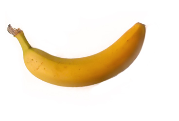

title: A red herring
author: Baker
slug: not-your-mothers-cooking

One day, while walking in the bamboo forest, an old, childless bamboo cutter called 竹取翁 came across a mysterious, shining stalk of bamboo.

After cutting it open, he found inside it a baby the size of his thumb. He rejoiced to find such a beautiful girl and took her home. He and his wife raised her as their own child and named her かぐや姫.

The end.
